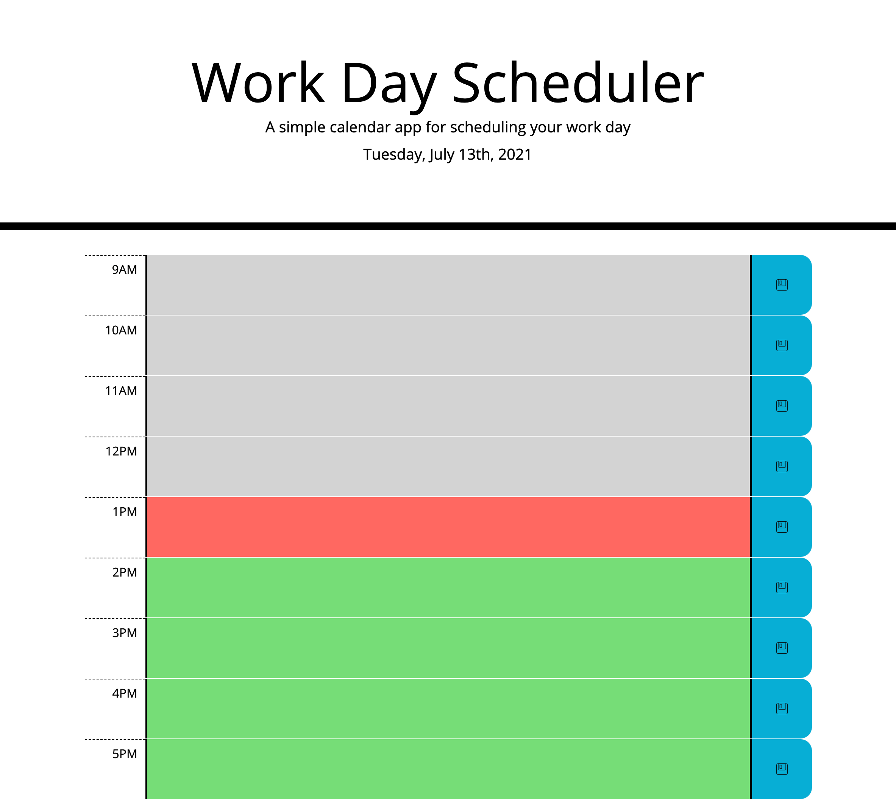

# Work Day Scheduler

This assignment, by modifying and expanding upon starter code, focuses on using jQuery and Moment.js. jQuery is used to manipulate the DOM and set/get local storage items for use in the scheduler. Moment.js is used to show the current date, as well as to determine the current hour of the day and change the colors of the task blocks based on whether they are in the past, the actual current hour, or future. 

For the layout, I decided to use CSS Grid, both for the practice in using a new (to me) tool, and because it seemed like a more natural way to set up the layout for the scheduler. This was a great learning experience, for one, but I believe it also allowed me to make a layout more in line with the mock-up. I used Flexbox to continue using a familiar tool with which to center the save button icon.

## Screenshot of completed application:

## Link to deployed application:
[Tucker Barrett's Work Day Scheduler](http://grinninbarrett.github.io/work-day-scheduler "Tucker's deployed Work Day Scheduler application")